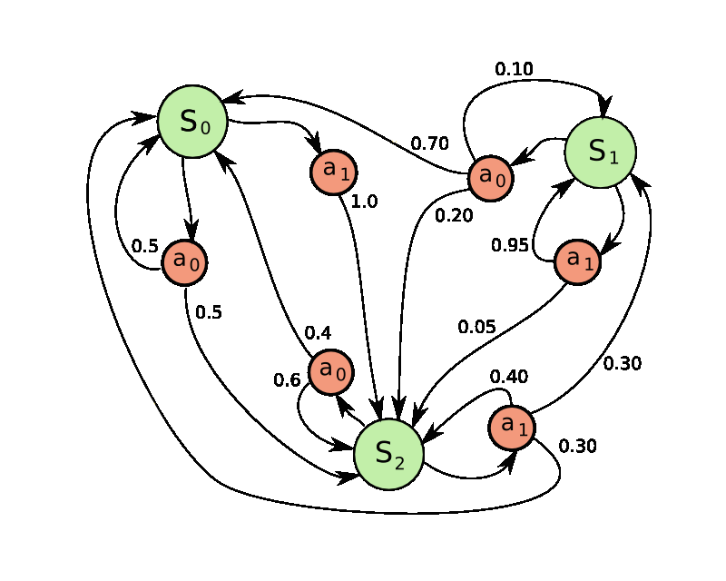
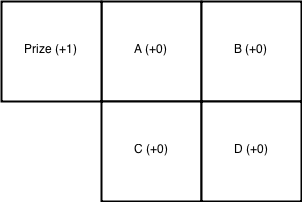

# Pavlov.js



##About

Pavlov.js uses Markov Decision Processes to implement reinforcement learning in JavaScript. For more on reinforcement learning, check out this <a href="http://nepste.in/jekyll/update/2015/02/22/MDP.html">blog post.</a>

## Installation

`npm install pavlov --save`


## Documentation & Examples

###Example 1

```javascript
var pavlov = require('Pavlov.js');

var obs1 = [
  {state:"notBroke", action:"notBet"},
  {state:"notBroke", action:"bet"},
  {state:"notBroke",action:"bet"},
  {state:"broke", action:"hangout"},
  {state:"broke",action:"hangout"}
];

var obs2 = [
  {state:"notBroke", action:"bet"},
  {state:"notBroke",action:"bet"},
  {state:"broke", action:"hangout"}
];

var obs3 = [
  {state:"notBroke", action:"notBet"},
  {state:"notBroke", action:"notBet"},
  {state:"notBroke", action:"notBet"}
];

var observations = [obs1,obs2,obs3];
var rewards = [-1,-1,0];

console.log(pavlov.policy(observations, rewards));

// { notBroke: 'notBet', broke: 'hangout' }

```


### Example 2



```javascript
var pavlov = require('Pavlov.js');

var obs1 = [{state:"A", action:"R"}, {state:"B", action:"B"}];
var obs2 = [{state:"A", action:"B"}, {state:"C", action:"R"}];
var obs3 = [{state:"A", action:"L"}, {state:"Prize", action:"R"}, {state:"Trap", action:"F"}];
var obs4 = [{state:"A", action:"L"}, {state:"Prize", action:"L"},{state:"Trap", action:"B"}];
var obs5 = [{state:"B",action:"B"},{state:"D",action:"L"}, {state: "C",action:"F"}, {state:"A",action:"R"}];
var obs6 = [{state:"C",action:"R"},{state:"D",action:"F"},{state:"B", action:"L"}, {state:"A", action:"L"}];

observations = [obs1,obs2,obs3,obs4,obs5,obs6];
rewards = [0,0,1,1,0,0];

console.log(pavlov.policy(observations,rewards));

// { A: 'L', B: 'L', C: 'F', Prize: 'R', Trap: 'B', D: 'L' }

```
